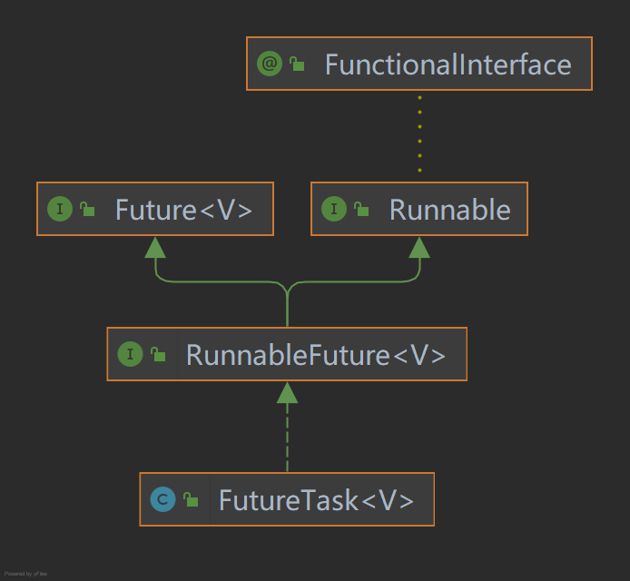
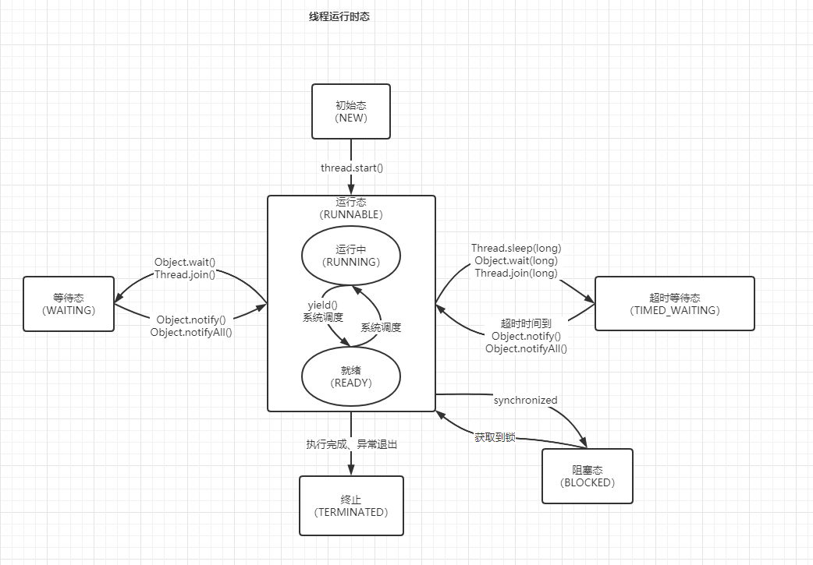

### 一、Thread 类

实例：

```java
class MyThread extends Thread {
    @Override
    public void run() {
        ...
    }
}
    
MyThread mt = new MyThread();
mt.start();
```

自定义线程类，承继于 Thread 类，实现 run()，调用 start() 启动。

```java
class Thread implements Runnable
```

Q：为什么要使用 start() 启动，而不是 run()。
A：JVM 下不同操作系统的实现不同。

```java
public synchronized void start() {
    ...
    boolean started = false;
    try {
        start0();
        started = true;
    } finally {
        ...
    }
}

private native void start0();
```

Q：start() 内部是如何实现的。 

A：参见上面代码

### 二、Runnable 接口

实例：

```java
class MyRunnable implements Runnable
new Thread(new MyRunnable()).start();
```

Thread 实际是实现的 Runnable 接口
Q：Runnable 接口与 Thread 类区别

### 三、Callable 接口

```java
MyCallable call = new MyCallable();
FutureTask<String> task = new FutureTask<>(call);
new Thread(task).start();
// 取得处理结果
String result = task.get();
```

Q：Callable 与 Runnable 的区别。
A：Callable 是可取得运行结果的 Runnable



FutureTask 分别实现 Runnable、Future 接口，这样就有`可运行`、`可取回` 的实现方法。


### 四、线程运行状态



#### 线程中断

```java
interrupt()
```


#### 强制执行

```java
join()
```


#### 线程暂停

```java
yield()
```


### 五、优先级

```java
setPriority()
```


### 线程同步

锁

synchronized

### 死锁


