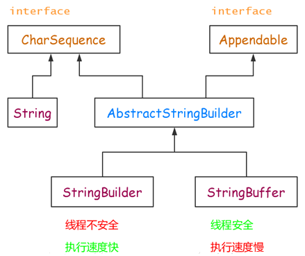

# String、StringBuffer和StringBuilder类的区别

在 [Java](http://c.biancheng.net/java/) 中字符串属于对象，Java 提供了 String 类来创建和操作字符串。String 类是不可变类，即一旦一个 String 对象被创建以后，包含在这个对象中的字符序列是不可改变的，直至这个对象被销毁。

Java 提供了两个可变字符串类 StringBuffer 和 StringBuilder，中文翻译为“字符串缓冲区”。

StringBuilder 类是 JDK 1.5 新增的类，它也代表可变字符串对象。实际上，StringBuilder 和 StringBuffer 功能基本相似，方法也差不多。不同的是，StringBuffer 是线程安全的，而 StringBuilder 则没有实现线程安全功能，所以性能略高。因此在通常情况下，如果需要创建一个内容可变的字符串对象，则应该优先考虑使用 StringBuilder 类。

StringBuffer、StringBuilder、String 中都实现了 CharSequence 接口。CharSequence 是一个定义字符串操作的接口，它只包括 length()、charAt(int index)、subSequence(int start, int end) 这几个 API。

StringBuffer、StringBuilder、String 对 CharSequence 接口的实现过程不一样，如下图 1 所示：

图 1 对CharSequence接口的实现

可见，String 直接实现了 CharSequence 接口，StringBuilder 和 StringBuffer 都是可变的字符序列，它们都继承于 AbstractStringBuilder，实现了 CharSequence 接口。

## 总结

String 是 Java 中基础且重要的类，被声明为 final class，是不可变字符串。因为它的不可变性，所以拼接字符串时候会产生很多无用的中间对象，如果频繁的进行这样的操作对性能有所影响。

StringBuffer 就是为了解决大量拼接字符串时产生很多中间对象问题而提供的一个类。它提供了 append 和 add 方法，可以将字符串添加到已有序列的末尾或指定位置，它的本质是一个线程安全的可修改的字符序列。

在很多情况下我们的字符串拼接操作不需要线程安全，所以 StringBuilder 登场了。StringBuilder 是 JDK1.5 发布的，它和 StringBuffer 本质上没什么区别，就是去掉了保证线程安全的那部分，减少了开销。

#### 线程安全：

StringBuffer：线程安全
StringBuilder：线程不安全

#### 速度：

一般情况下，速度从快到慢为 StringBuilder > StringBuffer > String，当然这是相对的，不是绝对的。

#### 使用环境：

操作少量的数据使用 String。
单线程操作大量数据使用 StringBuilder。
多线程操作大量数据使用 StringBuffer。