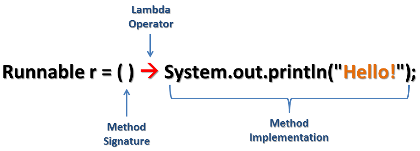

# Lambda 表达式
lambda表达式是一段可以传递的代码，它的核心思想是将面向对象中的传递数据变成传递行为。（行为参数化）
1. 什么是Lambda - 匿名函数
2. 为什么要使用Lambda - 简洁实现
3. 接口的要求 - 只能有一个抽象方法

1：在 java 8 中引入了一个新的操作符"->"，该操作符称为箭头操作符或Lambda操作符。
2：箭头操作符将Lambda表达式才分为两部分。
   
   左侧：Lambda 表达式的参数列表。
   右侧：Lambda 体，即对接口的实现。

java中内建的接口

简化操作

