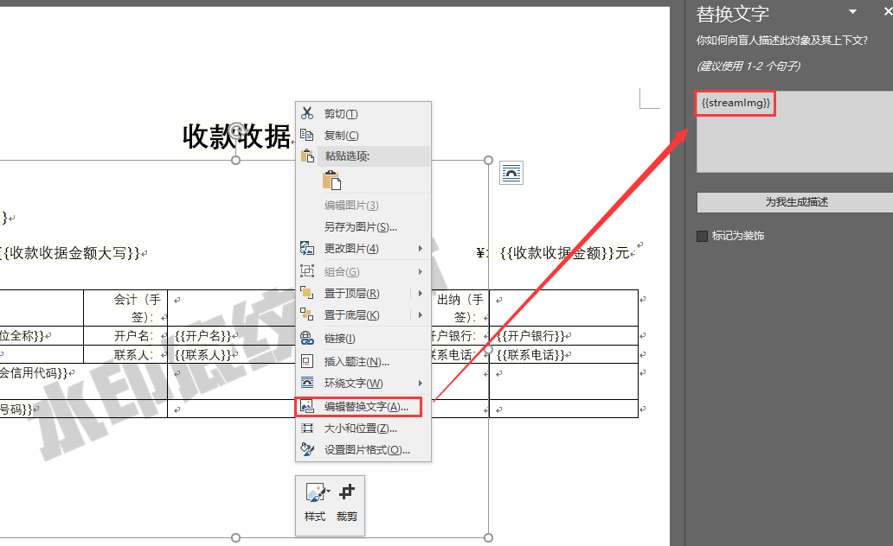

# 使用 poi-tl 进行 word 生成。

1. 文本替换，{{var}}。

2. 图片

   1. 不考虑样式时，直接插入使用 {{@var}}。

   2. 图片标签无法设置环绕版式和样式，如果对环绕版式有更高的要求可以采用替换占位图片方式。[引用标签-图片](http://deepoove.com/poi-tl/1.8.x/#ref-policy-section)

      

3. 表格

REF:http://deepoove.com/poi-tl/1.8.x/#ref-policy-section
